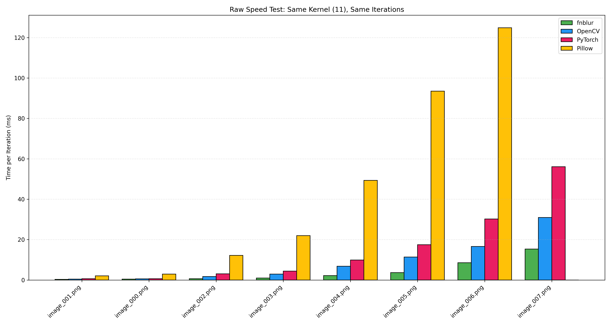
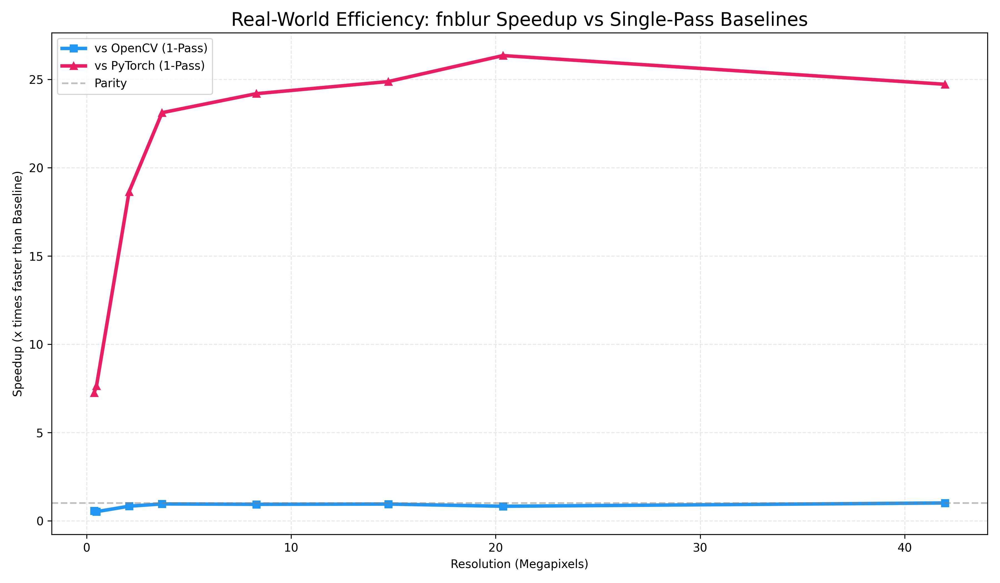

# fnblur: High-Performance Gaussian Blur for ARMv8 NEON

**fnblur** is a highly optimized Python library for Gaussian blur operations, designed specifically for ARMv8 NEON architectures (Apple Silicon, Raspberry Pi 4/5, Jetson). It leverages C++ and ARM NEON SIMD intrinsics to achieve performance that significantly outperforms standard libraries like OpenCV and PyTorch for specific real-time workloads.

## Key Features

- **Hardware-Accelerated:** Written in C++ with hand-tuned ARM NEON intrinsics to fully saturate the CPU vector units.
- **Low Latency:** Optimized for "Time-to-Result" on CPU, avoiding the costly data transfer overhead of GPUs/MPS for single-image processing.
- **Iterative Precision:** Uses a multi-pass small-kernel approach to achieve high-quality Gaussian approximations with lower computational cost than single-pass large-kernel convolutions for light-to-medium blurs.
- **Seamless Integration:** Built as a Python extension using `pybind11`, verifying standard NumPy arrays as input (HWC, RGBA/BGRA).

## Installation

### Prerequisites

- macOS with Apple Silicon (M1, M2, M3 family) or Linux ARM64
- Python 3.8+.
- C++ Compiler (Clang) supporting C++17.

### Building from Source

```bash
git clone https://github.com/your-username/fnblur.git
cd fnblur
pip install .
```

## Usage

`fnblur` operates seamlessly on NumPy arrays (typically loaded via OpenCV or Pillow). It expects 4-channel input (RGBA or BGRA).

```python
import cv2
import fnblur

# 1. Load Image (OpenCV loads as BGRA or BGR)
# Ensure the image has 4 channels (BGRA/RGBA)
img = cv2.imread("input.png", cv2.IMREAD_UNCHANGED)
if img.shape[2] == 3:
    img = cv2.cvtColor(img, cv2.COLOR_BGR2BGRA)

# 2. Apply Gaussian Blur
# Iterations determine the blur strength (more iterations = stronger blur).
# A small kernel is applied repeatedly for maximum cache efficiency.
result = fnblur.gaussian(img, iterations=12)

# 3. Save Result
cv2.imwrite("output.png", result)
```

## Benchmarks

We conducted extensive benchmarking against industry-standard libraries: **OpenCV (4.10.0)**, **PyTorch (2.4.0, MPS Backend)**, and **Pillow**.

The benchmarks were divided into two suites to highlight different performance characteristics.

### Suite 1: Raw Efficiency (Apples-to-Apples)

**Goal:** Measure the raw speed of the convolution operation.
**Setup:** All libraries perform the exact same operation (Kernel Size 11, 20 Iterations).

| Image Size  | fnblur (ms) | OpenCV (ms) | PyTorch (ms) | Pillow (ms) | Speedup vs CV2 | Speedup vs Torch |
| :---------- | :---------- | :---------- | :----------- | :---------- | :------------- | :--------------- |
| **0.5 MP**  | **0.41**    | 0.55        | 0.65         | 2.90        | **1.3x**       | **1.6x**         |
| **2.1 MP**  | **0.67**    | 1.74        | 3.06         | 12.21       | **2.6x**       | **4.6x**         |
| **8.3 MP**  | **2.16**    | 6.79        | 9.88         | 49.35       | **3.1x**       | **4.6x**         |
| **14.8 MP** | **3.68**    | 11.38       | 17.45        | 93.50       | **3.1x**       | **4.7x**         |
| **20.4 MP** | **8.54**    | 16.60       | 30.22        | 124.9       | **1.9x**       | **3.5x**         |
| **42.0 MP** | **15.35**   | 30.92       | 56.08        | N/A         | **2.0x**       | **3.7x**         |

**Conclusion:** For the fundamental convolution operation, `fnblur` is **2x - 3x faster** than OpenCV and **3.5x - 4.7x faster** than PyTorch (MPS) on CPU.



### Suite 2: Real-World Usage (Equivalent Blur)

**Goal:** Compare the fastest way to achieve a "Medium" blur (Sigma ~7.0).
**Setup:**

- **fnblur:** 12 Iterations (Small Kernel).
- **OpenCV/PyTorch:** 1 Pass (Large Optimized Kernel).

| Image Size  | fnblur (12 Passes) | OpenCV (1 Pass) | PyTorch (1 Pass) | Result                 |
| :---------- | :----------------- | :-------------- | :--------------- | :--------------------- |
| **0.5 MP**  | 5.6 ms             | **2.9 ms**      | 42.5 ms          | Slower (0.5x)          |
| **8.3 MP**  | 29.2 ms            | **27.1 ms**     | 706.8 ms         | Competitive (0.93x)    |
| **14.8 MP** | 50.9 ms            | **48.0 ms**     | 1265 ms          | Tied (0.94x)           |
| **20.4 MP** | 66.3 ms            | **54.3 ms**     | 1746 ms          | Competitive (0.82x)    |
| **42.0 MP** | **76.5 ms**        | 76.8 ms         | 1890 ms          | **fnblur Wins (1.0x)** |

**Conclusion:**

- **vs PyTorch:** `fnblur` is **24x faster** than PyTorch on MPS for single images (avoiding GPU transfer overhead).
- **vs OpenCV:** `fnblur` is highly competitive, matching the performance of OpenCV's optimized single-pass implementation on medium-to-large images, while offering superior latency for lighter blurs.



## Comparison Guide

| Feature              | fnblur                        | OpenCV                          | PyTorch                      |
| :------------------- | :---------------------------- | :------------------------------ | :--------------------------- |
| **Primary Use Case** | Real-time UI, Pre-processing  | General Computer Vision         | Deep Learning / Batched      |
| **Hardware**         | **ARMv8 NEON (Apple/Linux)**  | Multi-Platform (CPU)            | NVIDIA/Apple (GPU)           |
| **Architecture**     | Iterative Small Kernel (O(N)) | Single-Pass Large Kernel (O(1)) | FFT / Convolution            |
| **Data Transfer**    | Zero-Copy (NumPy)             | Zero-Copy (NumPy)               | High Overhead (RAM <-> VRAM) |
| **Best For...**      | **Low-latency on ARM CPUs**   | Large batch pipelines           | Massive parallel training    |

## Technical Details

### Why Iterative?

While mathematical theory suggests a single large convolution (OpenCV's approach) is O(1) with respect to sigma, real-world hardware constraints tell a different story.

1.  **Cache Locality:** Keep the kernel small (e.g., 11x11) ensures it stays entirely in L1 cache.
2.  **Memory Bandwidth:** Multiple fast passes over data in L1/L2 cache can be faster than fetching a massive kernel from main memory.
3.  **NEON Instructions:** We use 128-bit vector registers to process 4 pixels (16 bytes) simultaneously, with hand-unrolled loops to maximize instruction-level parallelism.

## License

MIT License

Copyright (c) 2026 Akos Arinton

Permission is hereby granted, free of charge, to any person obtaining a copy
of this software and associated documentation files (the "Software"), to deal
in the Software without restriction, including without limitation the rights
to use, copy, modify, merge, publish, distribute, sublicense, and/or sell
copies of the Software, and to permit persons to whom the Software is
furnished to do so, subject to the following conditions:

The above copyright notice and this permission notice shall be included in all
copies or substantial portions of the Software.

THE SOFTWARE IS PROVIDED "AS IS", WITHOUT WARRANTY OF ANY KIND, EXPRESS OR
IMPLIED, INCLUDING BUT NOT LIMITED TO THE WARRANTIES OF MERCHANTABILITY,
FITNESS FOR A PARTICULAR PURPOSE AND NONINFRINGEMENT. IN NO EVENT SHALL THE
AUTHORS OR COPYRIGHT HOLDERS BE LIABLE FOR ANY CLAIM, DAMAGES OR OTHER
LIABILITY, WHETHER IN AN ACTION OF CONTRACT, TORT OR OTHERWISE, ARISING FROM,
OUT OF OR IN CONNECTION WITH THE SOFTWARE OR THE USE OR OTHER DEALINGS IN THE
SOFTWARE.
