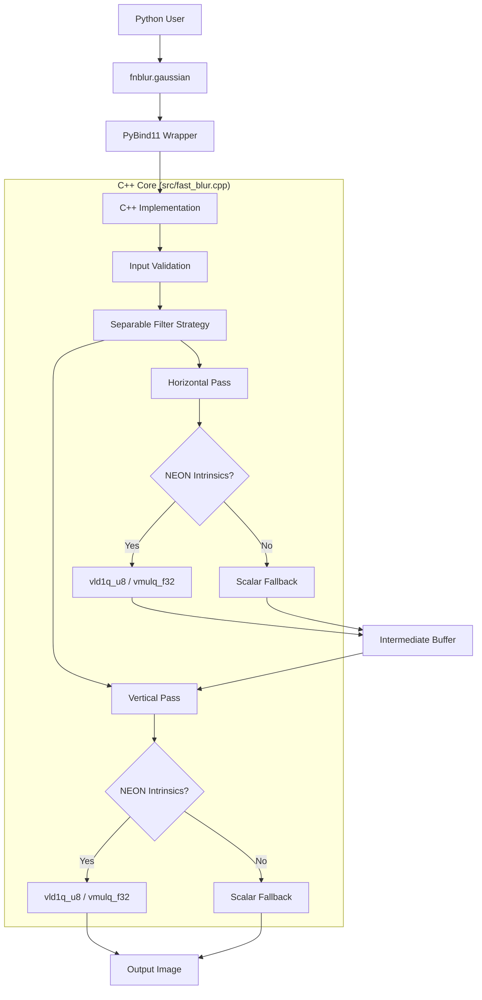

# Architecture Overview

The `fnblur` library uses C++17 and platform-specific intrinsics (ARMv8 NEON) to achieve high-performance image processing.

## Key Optimization Strategies

1.  **Separable Filters**: A 2D Gaussian blur is separated into two 1D passes (horizontal then vertical), reducing complexity from O(K^2) to O(K).
2.  **NEON SIMD**: Critical loops are vectorized using ARM NEON intrinsics to process multiple pixels in parallel.
3.  **Direct Buffer Access**: Pybind11 allows direct access to NumPy array buffers, avoiding unnecessary data copying.
